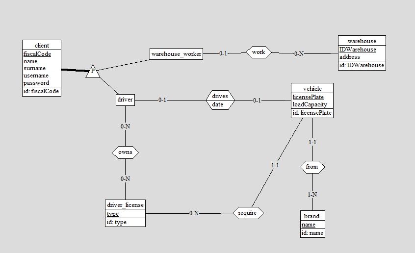
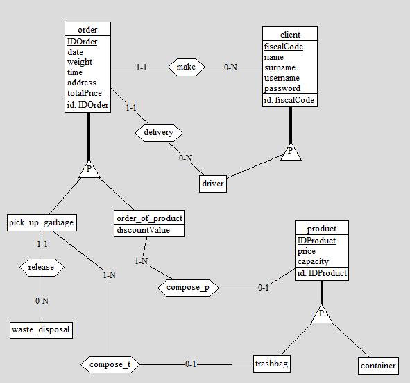
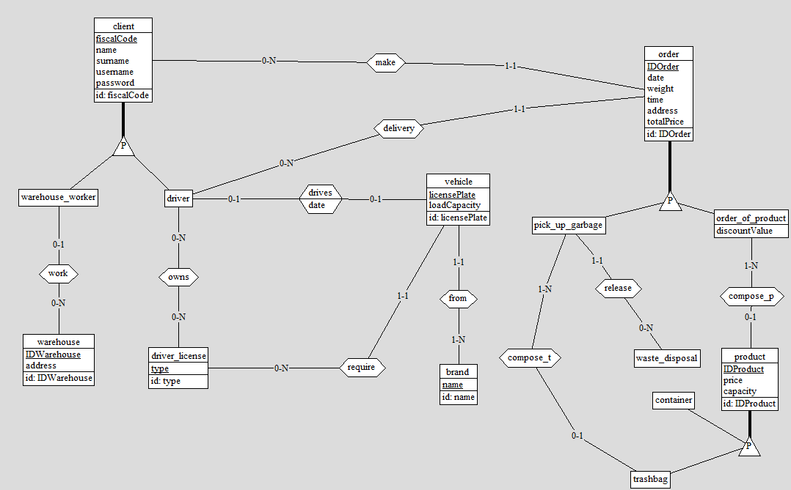
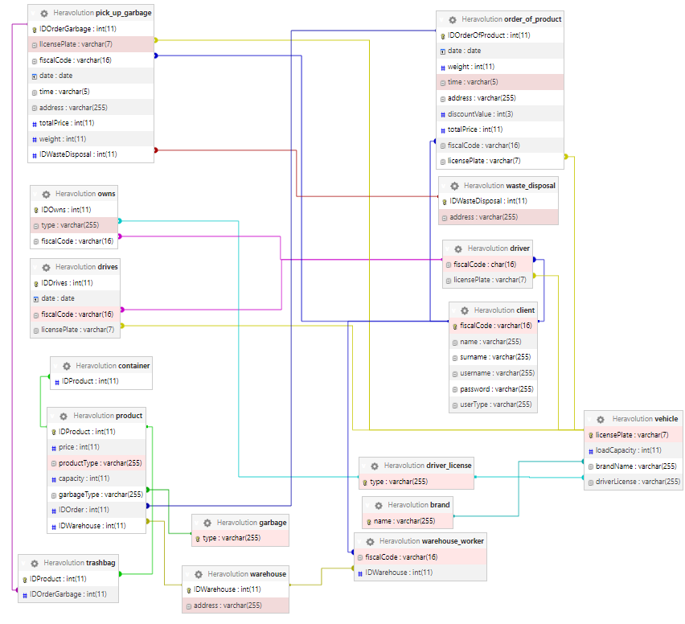
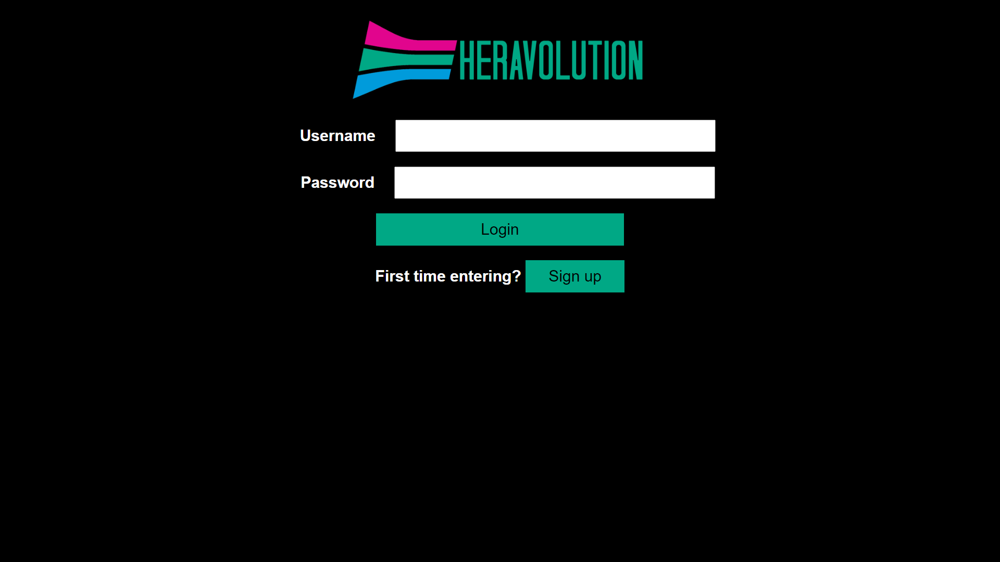
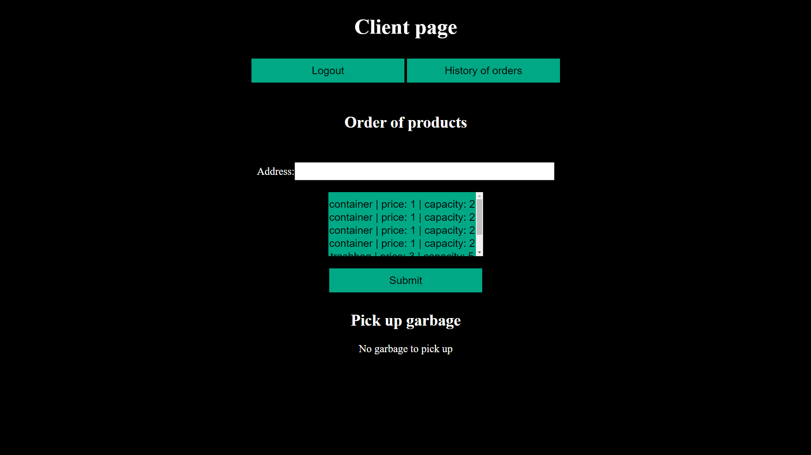
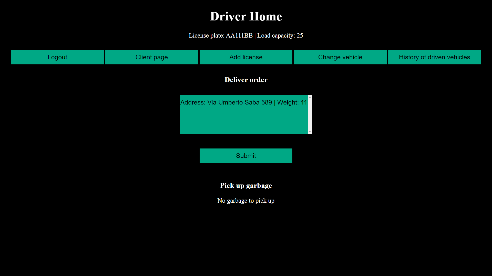
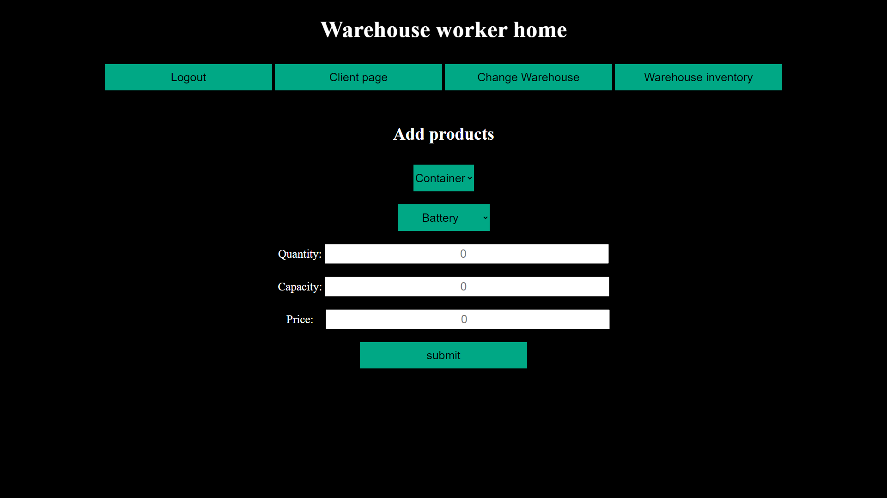

<style>
table {
  border-collapse: collapse;
  width : 100%;
}

</style>
<div style="text-align: center">
    <h1> Elaborato per il corso di basi di dati </h1>
    <h2> A.A 2021/2022 <br> Heravolution </h2>
    <br>
    <h3> Componenti: <br>
        Samuele De Tuglie samuele.detuglie@studio.unibo.it 0000989483 <br>
        Cristina Zoccola cristina.zoccola@studio.unibo.it 0000969874 </h3>
</div>
<div style="page-break-after: always;"/>

<h1> Indice </h1>

- [Analisi dei requisiti](#analisi-dei-requisiti)
  - [Intervista](#intervista)
  - [Estrazione dei concetti principali](#estrazione-dei-concetti-principali)
- [Progettazione concettuale](#progettazione-concettuale)
  - [Schema scheletro](#schema-scheletro)
  - [Schema finale](#schema-finale)
- [Progettazione logica](#progettazione-logica)
  - [Stima del volume dei dati](#stima-del-volume-dei-dati)
  - [Descrizione delle operazioni principali e stima delle loro frequenze](#descrizione-delle-operazioni-principali-e-stima-delle-loro-frequenze)
  - [Schemi di navigazione e tabelle degli accessi](#schemi-di-navigazione-e-tabelle-degli-accessi)
    - [*Operazioni principali*](#operazioni-principali)
    - [*Operazioni di controllo*](#operazioni-di-controllo)
  - [Raffinamento dello schema](#raffinamento-dello-schema)
  - [Analisi delle ridondanze](#analisi-delle-ridondanze)
  - [Traduzione di entità e associazioni in relazioni](#traduzione-di-entità-e-associazioni-in-relazioni)
  - [Schema relazione finale](#schema-relazione-finale)
  - [Traduzione delle operazioni in query SQL](#traduzione-delle-operazioni-in-query-sql)
    - [*Query principali*](#query-principali)
    - [*Query di controllo*](#query-di-controllo)
- [Progettazione dell'applicazione](#progettazione-dellapplicazione)

<div style="page-break-after: always;"/>

# Analisi dei requisiti
## Intervista
Si vuole gestire una compagnia che tratta la vendita e la spedizione di prodotti per la raccolta differenziata e lo smaltimento dei rifiuti. <br>
Comprende tre tipi di utenti: clienti, guidatori e magazzinieri. <br> 
I clienti sono gli utenti base esterni alla compagnia, che usufruiscono dei servizi offerti, quali la vendita e la spedizione di prodotti (sacchetti della spazzatura, contenitori per la raccolta differenziata) e la raccolta dei rifiuti a domicilio. <br>
La raccolta dei rifiuti a domicilio sarà disponibile solo se prima sono stati acquistati i relativi sacchetti della compagnia. <br>
I guidatori si occupano della consegna dei prodotti acquistati e di gestire la raccolta dei rifiuti a domicilio scegliendo anche l'apposita discarica in cui smaltirli, inoltre sono anche considerati dei clienti (quindi possono usufruire dei servizi legati a tale ruolo). <br>
Ogni guidatore deve inserire le patenti che possiede, con la possibilità di aggiornarle in futuro, quindi per effettuare le proprie mansioni potrà scegliere solo tra i veicoli che gli è permesso guidare, stando però attento a cosa deve trasportare siccome ogni mezzo ha una capacità di trasporto massima. <br>
I magazzinieri sono coloro che si occupano di rifornire i diversi magazzini con i prodotti da vendere, durate l'inserimento deve specificare tutte le caratteristiche dei prodotti, proprio come i guidatori anche loro sono considerati dei clienti. <br>
Ogni magazziniere deve scegliere un magazzino in cui rifornire i prodotti, che inoltre può cambiare in qualsiasi momento. <br>
## Estrazione dei concetti principali
| Termine      | Descrizione                                                            | Sinonimi         |
|:-------------|:-----------------------------------------------------------------------|:-----------------|
| Cliente      |utente esterno che interagisce con la compagnia                         | client           |
| Guidatore    |utente interno che si occupa delle consegne                             | driver           |
| Magazziniere |utente interno che si occupa del magazzino                              | warehouse worker |
| Veicolo      |mezzo per trasportare prodotti e spazzatura                             | vehicle          |
| Patente      |licenza per la guida                                                    | driver license   |
| Ordine       |effettuato dai clienti per acquistare prodotti e la raccolta dei rifiuti| order            |
| Magazzino    |struttura che contiene i prodotti da vendere/acquistare                 | warehouse        |
| Prodotto     |oggetto che può essere venduto/acquistato                               | product          |
| Contenitore  |oggetto che contiene i sacchetti della spazzatura da ritirare           | container        |
| Sacchetto    |oggetto che contiene la spazzatura da ritirare                          | trashbag         |


Ogni **cliente** può effettuare **ordini** di vari **prodotti**, ad ogni **guidatore** è associato un **veicolo** e ad ogni **magazziniere** un **magazzino**. <br>

Lista delle principali operazioni effettuate:
- aggiungere un nuovo utente (cliente, guidatore o magazziniere)
- effettuare l'accesso degli utenti con i relativi permessi
- effettuare un nuovo ordine di prodotti
- richiedere la raccolta della spazzatura a domicilio
- mostrare la cronologia degli ordini effettuati
- assegnare un veicolo ad un guidatore
- inserire le patenti di un guidatore
- mostrare la cronologia dei veicoli assegnati ad un guidatore
- consegnare gli ordini effettuati
- raccogliere la spazzatura a domicilio e rilasciarla in una discarica specifica
- associare un magazzino ad un magazziniere
- aggiungere un nuovo prodotto al magazzino
- visualizzare l'inventario di tutti i magazzini

<div style="page-break-after: always;"/>

# Progettazione concettuale
## Schema scheletro
 <br>
L'entità _driver_ e l'entità _warehouse worker_ sono la generalizzazione dell'entita _client_. <br>
Sono identificati per _fiscal code_ e vengono utilizzati l'_username_ e la _password_ per accedere all'applicazione. <br>
Ogni _driver_ possiede una o più _driver license_. <br>
Ogni _vehicle_ è identificato dalla _license plate_ e può essere guidato da un solo _driver_ alla volta che deve possedere la _driver license_ richiesta, inoltre ad ogni veicolo è associato un _brand_; tramite il campo _date_ nell'associazione _drives_ ci è possibile tenere traccia dei veicoli guidati da ogni guidatore durante quella giornata. <br>

 <br>
L'entità _order_ ha associato il _client_ che l'ha effettuato e il _driver_ che lo ha consegnato. <br>
Esistono due tipi di ordini: _pick up garbage_ e _order of product_ che sono la generalizzazione dell'entita _order_. <br>
Ogni _pick up garbage_ è poi rilasciato in una _waste disposal_. <br>
Ad ogni _order of product_ sono associati i prodotti acquistati, mentre ad un _pick up garbage_ sono associati i _trashbag_ da ritirare. <br>
Ad ogni _product_ quando viene acquistato viene associato l'_order of product_ e/o il _pick up garbage_ corrispondente. <br>
Dopo una certa quantità di ordini il cliente ha uno sconto, memorizzato nel campo _discont_ della tabella _order of product_. <br>

<div style="page-break-after: always;"/>

## Schema finale
 <br>

<div style="page-break-after: always;"/>

# Progettazione logica
## Stima del volume dei dati

| Concetto         | Costrutto | Volume    |
|:-----------------|:---------:|:----------|
| client           | E         | 2.004.000 |
| driver           | E         | 2.000     |
| warehouse worker | E         | 2.000     |
| warehouse        | E         | 40        |
| driver license   | E         | 5         |
| vehicle          | E         | 1200      |
| brand            | E         | 20        |
| drives           | R         | 500.000   |
| order            | E         | 2.000.000 |
| pick up garbage  | E         | 1.100.000 |
| order of product | E         | 1.200.000 |
| product          | E         | 5.000.000 |
| trashbag         | E         | 3.700.000 |
| container        | E         | 1.300.000 |
| waste disposal   | E         | 20        |

Ci aspettiamo di avere un numero elevato e sempre in aumento di _order_ (_pick up garbage_, _order of product_), _product_ (_trashbag_, _container_) e _drives_ , rispettivamente perchè gli _order_ e i _drives_ servono per gli storici, mentre i _product_ una volta essere stati venduti non vengono eliminati dal database per poter risalire a quali prodotti sono stati acquistati nei singoli ordini ed inoltre per poter scegliere quali _trashbag_ possono essere ritirate. <br>

<div style="page-break-after: always;"/>

## Descrizione delle operazioni principali e stima delle loro frequenze

| Codice | Operazione                                   | Frequenza         |
|:------:|:---------------------------------------------|:------------------|
| 1      |aggiungere un nuovo cliente                   | 80 al giorno      |
| 2      |aggiungere un nuovo magazziniere              | 30 all'anno       |
| 3      |aggiungere un nuovo guidatore                 | 30 all'anno       |
| 4      |effettuare l'accesso degli utenti             | 150.000 al giorno |
| 5      |effettuare un nuovo ordine di prodotti        | 10.000 al giorno  |
| 6      |richiedere la raccolta della spazzatura       | 5.000 al giorno   |
| 7      |mostrare la cronologia degli ordini effettuati| 3.000 al giorno   |
| 8      |assegnare un veicolo ad un guidatore          | 8.000 al giorno   |
| 9      |inserire le patenti di un guidatore           | 70 all'anno       |
| 10     |mostrare la cronologia dei veicoli assegnati  | 100 all'anno      |
| 11     |consegnare gli ordini effettuati              | 5.500 al giorno   |
| 12     |raccogliere la spazzatura e rilasciarla       | 2.500 al giorno   |
| 13     |associare un magazzino ad un magazziniere     | 45 all'anno       |
| 14     |aggiungere un nuovo prodotto al magazzino     | 25.000 al giorno  |
| 15     |visualizzare l'inventario di tutti i magazzini| 2 alla settimana  |

## Schemi di navigazione e tabelle degli accessi
### *Operazioni principali*
Di seguito sono riportate le tabelle degli accessi per ogni operazione sopra riportata: <br>

<h4> - Operazione 1: aggiungere un nuovo cliente </h4>

| Concetto | Costrutto | Accessi | Tipo |
|:---------|:---------:|:-------:|:----:|
| client   | E         | 2       | L    |
| client   | E         | 1       | S    |

totale: 2L + 1S → 80 al giorno

<div style="page-break-after: always;"/>

<h4> - Operazione 2: aggiungere un nuovo magazziniere </h4>

| Concetto         | Costrutto | Accessi | Tipo |
|:-----------------|:---------:|:-------:|:----:|
| client           | E         | 2       | L    |
| client           | E         | 1       | S    |
| warehouse worker | E         | 1       | S    |

totale: 2L + 2S → 30 all'anno

<h4> - Operazione 3: aggiungere un nuovo guidatore </h4>

| Concetto | Costrutto | Accessi | Tipo |
|:---------|:---------:|:-------:|:----:|
| client   | E         | 2       | L    |
| client   | E         | 1       | S    |
| driver   | E         | 1       | S    |

totale: 2L + 2S → 30 all'anno

<h4> - Operazione 4: effettuare l'accesso degli utenti </h4>

| Concetto | Costrutto | Accessi | Tipo |
|:---------|:---------:|:-------:|:----:|
| client   | E         | 1       | L    |

totale: 1L → 150.000 al giorno

<h4> - Operazione 5: effettuare un nuovo ordine di prodotti </h4>

| Concetto         | Costrutto | Accessi | Tipo |
|:-----------------|:---------:|:-------:|:----:|
| product          | E         | 3       | L    |
| order of product | E         | 1       | L    |
| order of product | E         | 1       | S    |
| product          | E         | 1       | S    |

totale: 4L + 2S → 10.000 al giorno

<div style="page-break-after: always;"/>

<h4> - Operazione 6: richiedere la raccolta della spazzatura </h4>

| Concetto         | Costrutto | Accessi | Tipo |
|:-----------------|:---------:|:-------:|:----:|
| product          | E         | 2       | L    |
| trashbag         | E         | 1       | L    |
| order of product | E         | 1       | L    |
| pick up garbage  | E         | 1       | S    |
| trashbag         | E         | 1       | S    |

totale: 4L + 2S → 5.000 al giorno

<h4> - Operazione 7: mostrare la cronologia degli ordini effettuati </h4>

| Concetto         | Costrutto | Accessi | Tipo |
|:-----------------|:---------:|:-------:|:----:|
| order of product | E         | 1       | L    |
| pick up garbage  | E         | 1       | L    |
| waste disposal   | E         | 1       | L    |

totale: 3L → 3.000 al giorno

<h4> - Operazione 8: assegnare un veicolo ad un guidatore </h4>

| Concetto         | Costrutto | Accessi | Tipo |
|:-----------------|:---------:|:-------:|:----:|
| driver           | E         | 3       | L    |
| vehicle          | E         | 1       | L    |
| owns             | R         | 1       | L    |
| driver           | E         | 1       | S    |
| drives           | R         | 1       | S    |

totale: 5L + 2S → 8.000 al giorno

<div style="page-break-after: always;"/>


<h4> - Operazione 9: inserire le patenti di un guidatore </h4>

| Concetto         | Costrutto | Accessi | Tipo |
|:-----------------|:---------:|:-------:|:----:|
| owns             | R         | 2       | L    |
| driver license   | E         | 1       | L    |
| owns             | R         | 1       | S    |

totale: 3L + 1S → 70 all'anno

<h4> - Operazione 10: mostrare la cronologia dei veicoli assegnati </h4>

| Concetto         | Costrutto | Accessi | Tipo |
|:-----------------|:---------:|:-------:|:----:|
| drives           | R         | 1       | L    |
| vehicle          | E         | 1       | L    |

totale: 2L → 100 all'anno

<h4> - Operazione 11: consegnare gli ordini effettuati </h4> 

| Concetto         | Costrutto | Accessi | Tipo |
|:-----------------|:---------:|:-------:|:----:|
| driver           | E         | 1       | L    |
| vehicle          | E         | 1       | L    |
| order of product | E         | 2       | L    |
| order of product | E         | 1       | S    |
| driver           | E         | 1       | S    |

totale: 4L + 2S → 5.500 al giorno

<div style="page-break-after: always;"/>

<h4> - Operazione 12: raccogliere la spazzatura e rilasciarla </h4>

| Concetto         | Costrutto | Accessi | Tipo |
|:-----------------|:---------:|:-------:|:----:|
| driver           | E         | 1       | L    |
| vehicle          | E         | 1       | L    |
| pick up garbage  | E         | 2       | L    |
| waste disposal   | E         | 1       | L    |
| pick up garbage  | E         | 1       | S    |
| driver           | E         | 1       | S    |

totale: 5L + 2S → 2.500 al giorno

<h4> - Operazione 13: associare un magazzino ad un magazziniere </h4>

| Concetto         | Costrutto | Accessi | Tipo |
|:-----------------|:---------:|:-------:|:----:|
| warehouse worker | E         | 2       | L    |
| warehouse        | E         | 1       | L    |
| warehouse worker | E         | 1       | S    |

totale: 3L + 1S → 45 all'anno

<h4> - Operazione 14: aggiungere un nuovo prodotto al magazzino</h4>

| Concetto           | Costrutto | Accessi | Tipo |
|:-------------------|:---------:|:-------:|:----:|
| warehouse worker   | E         | 1       | L    |
| garbage            | E         | 1       | L    |
| product            | E         | 1       | S    |
| trashbag/container | E         | 1       | S    |  

L'ultima operazione cambia in base a che tipo di prodotto si sta aggiungendo

totale: 2L + 2S → 25.000 al giorno

<div style="page-break-after: always;"/>

<h4> - Operazione 15: visualizzare l'inventario di tutti i magazzini </h4>

| Concetto         | Costrutto | Accessi | Tipo |
|:-----------------|:---------:|:-------:|:----:|
| warehouse        | E         | 1       | L    |
| product          | E         | 1       | L    |

totale: 2L → 2 alla settimana

### *Operazioni di controllo*
Le sequenti operazioni vengono eseguite ogni volta che un guidatore vuole rispondere ad un ordine.

<h4> - Controllo se c'è una patente associata al guidatore </h4> 

| Concetto         | Costrutto | Accessi | Tipo |
|:-----------------|:---------:|:-------:|:----:|
| owns             | R         | 1       | L    |

totale: 1L

<h4> - Controllo se il veicolo è assegnato al guidatore </h4> 

| Concetto         | Costrutto | Accessi | Tipo |
|:-----------------|:---------:|:-------:|:----:|
| driver           | E         | 1       | L    |

totale: 1L

<div style="page-break-after: always;"/>

## Raffinamento dello schema
<h4> - Eliminazione delle gerarchie </h4>

È stata eliminata la gerarchia _order_ tramite il collasso verso il basso, replicando gli attributi in _order\_of\_product_ e _pick\_up\_garbage_.<br>
Per le gerarchie _product_ e _client_ si è scelto di utilizzare un metodo ibrido, utilizzando il collasso verso l'alto, ma mantenendo le entità figlie in quanto alcuni campi proprietari all'entità sono stati mantenuti in esse (ad esempio il campo _licensePlate_ di _driver_ non poteva essere inserito in _client_, oppure il campo _IDOrderGarbage_ di _trashbag_ non poteva essere messo in _product_).

<h4> - Trasformazione di relazioni in entità </h4>

È stata trasformata la relazione _owns_ in un'entità che rappresenta la relazione molti a molti tra _driver_ e _driver\_license_; è stata trasformata anche la relazione _drives_ che ci permette di mantenere lo storico dei veicoli assegnati ai guidatori. 
<br><br>
## Analisi delle ridondanze
La prima ridondanza che abbiamo deciso di inserire è il campo _userType_ in client, mantenendo le tabelle _driver_ e _warehouse\_worker_.

Si può vedere come in fase di accesso all'applicazione questo renda l'operazione meno costosa:

| Concetto | Costrutto | Accessi | Tipo |
|:---------|:---------:|:-------:|:----:|
| client   | E         | 1       | L    |

totale: 1L → 150.000 al giorno

Senza ridondanza sarebbe necessario controllare ogni entità in base a quanti tipi di utenti esistono.

| Concetto         | Costrutto | Accessi | Tipo |
|:-----------------|:---------:|:-------:|:----:|
| client           | E         | 1       | L    |
| driver           | E         | 1       | L    |
| warehouse worker | E         | 1       | L    |

totale: 3L → 450.000 al giorno

La seconda ridondanza è presente nell'entità _product_, che contiene il campo _productType_ (stesso caso della ridondanza sopra citata).

<div style="page-break-after: always;"/>

## Traduzione di entità e associazioni in relazioni

|Traduzione tabelle                                                                                                                                                  |
|:-------------------------------------------------------------------------------------------------------------------------------------------------------------------|
| client (<u>fiscalCode</u>, name, surname, username, password, userType)                                                                                            |
| driver (<u>fiscalCode</u> : client, licensePlate* : vehicle)                                                                                                       |
| drives (<u>IDDrives</u>, date, fiscalCode : client, licensePlate : vehicle)                                                                                        |
| driver_license (<u>type</u>)                                                                                                                                       |
| owns (<u>IDOwns</u>, type : driver_license, fiscalCode:driver)                                                                                                     |
| vehicle (<u>licensePlate</u>, loadCapacity, brandName : brand, driverLicense : driver_license)                                                                     |
| brand (<u>name</u>)                                                                                                                                                |
| warehouse_worker (<u>fiscalCode</u> : client, IDWarehouse* : warehouse)                                                                                            |
| warehouse (<u>IDWarehouse</u>, address)                                                                                                                            |
| product (<u>IDProduct</u>, price, productType, capacity, garbageType : garbage, IDOrder* : order_of_product,  IDWarehouse : warehouse)                              |
| trashbag (<u>IDProduct</u> : product, IDOrderGarbage* : pick_up_garbage)                                                                                           |
| container (<u>IDProduct</u> : product)                                                                                                                             |
| garbage (<u> type </u>)                                                                                                                                            |
| pick_up_garbage (<u>IDOrderGarbage</u>, date, time, address, totalPrice, weight, licensePlate* : vehicle, <br> fiscalCode : client, IDWasteDisposal* : waste_disposal)  |
| order_of_product (<u>IDOrderOfProduct</u>, date, weight, time, address, discountValue*, totalPrice, <br>  fiscalCode : client, licensePlate* : vehicle)                  |
| waste_disposal (<u>IDWasteDisposal</u>, address)                                                                                                                   |

<div style="page-break-after: always;"/>

## Schema relazione finale

 <br>

<div style="page-break-after: always;"/>

## Traduzione delle operazioni in query SQL

### *Query principali*

Di seguito nelle operazioni effettuate i seguenti valori indicano: <br>
``` $_POST[] ``` : è l'input dell'utente all'interno delle corrispettive form <br>
``` $_SESSION[] ``` : è il modo di mantenere in memoria i dati dell'utente che ha effettuato l'accesso <br>
```$last_id```: è la variabile che contiene l'ultimo _ID_ inserito <br>
``` get_array() ``` : è una funzione che permette di ottenere l'array contenente i valori richiesti<br>
``` implode() ``` : permette di spezzare un array per ottenere i valori richiesti<br>

<h4> - Operazione 1: aggiungere un nuovo cliente </h4>

Query per controllare se esiste già un cliente con lo stesso codice fiscale:
```sql
SELECT * 
FROM client 
WHERE fiscalCode = '".$_POST["fiscalCode"]."'
```
Query per controllare se esiste già un cliente con lo stesso username:
```sql
SELECT * 
FROM client 
WHERE username = '".$_POST["username"]."'
```
Query per inserire il cliente:
```sql
INSERT INTO client(name, surname, fiscalCode, username, password, userType) 
VALUES (?,?,?,?,?,?)
```

<h4> - Operazione 2: aggiungere un nuovo magazziniere </h4>

Si svolge come l'operazione 1 ma con l'aggiunta della query per inserire il magazziniere:
```sql
INSERT INTO warehouse_worker(fiscalCode) 
VALUES (?)
```

<div style="page-break-after: always;"/>

<h4> - Operazione 3: aggiungere un nuovo guidatore </h4>

Si svolge come l'operazione 1 ma con l'aggiunta della query per inserire il guidatore:
```sql
INSERT INTO driver(fiscalCode) 
VALUES (?)
```

<h4> - Operazione 4: effettuare l'accesso degli utenti </h4>

```sql
SELECT fiscalCode, userType, password 
FROM client 
WHERE username = '".$_POST["username"]."' 
LIMIT 1 
```

<h4> - Operazione 5: effettuare un nuovo ordine di prodotti </h4>

Query per visualizzare i prodotti disponibili (per essere acquistabili devono aver il campo _IDOrder_ nullo):
```sql
SELECT * 
FROM product 
WHERE IDOrder IS NULL 
ORDER BY productType
```
Query per ottenere l'eventuale sconto:
```sql
SELECT COUNT(*) AS counter 
FROM order_of_product 
WHERE fiscalCode = '".$_SESSION['fiscalCode']."'
```
Query per ottenere il peso totale dell'ordine:
```sql
SELECT SUM(capacity) AS weight 
FROM product 
WHERE IDProduct IN (".get_array($product).")
```

<div style="page-break-after: always;"/>

Query per ottenere il prezzo totale dell'ordine:
```sql
SELECT SUM(price) AS totalPrice 
FROM product 
WHERE IDProduct IN (".get_array($_POST["product"]).")
```
Query per inserire l'ordine:
```sql
INSERT INTO order_of_product(date, time, address, discountValue, totalPrice, fiscalCode, weight) 
VALUES (?, ?, ?, ?, ?, ?, ?)
```
Query per inserire l'_ID_ dell'ordine ai prodotti:
```sql
UPDATE product 
SET IDOrder = ".$last_id." 
WHERE IDProduct IN (".get_array($_POST["product"]).")
```
<h4> - Operazione 6: richiedere la raccolta della spazzatura </h4>

Query per visualizzare i sacchetti che possono essere raccolti (devono essere stati acquistati da quel cliente e devono avere il campo _IDOrderGarbage_ nullo):
```sql
SELECT product.* FROM product, trashbag 
WHERE product.productType = 'trashbag' 
  AND trashbag.IDOrderGarbage IS NULL 
  AND product.IDOrder = ANY
  ( SELECT IDOrderOfProduct FROM order_of_product 
    WHERE fiscalcode = '".$_SESSION['fiscalCode']."' 
    AND licensePlate IS NOT NULL)
  AND product.IDProduct = trashbag.IDProduct
```
Query per ottenere il peso totale dell'ordine:
```sql
SELECT SUM(capacity) AS weight 
FROM product 
WHERE IDProduct IN (".get_array($product).")
```

<div style="page-break-after: always;"/>

Query per inserire l'ordine:
```sql
INSERT INTO pick_up_garbage(fiscalCode, date, time, address, totalPrice, weight) 
VALUES (?, ?, ?, ?, ?, ?)
```
Query per inserire l'_ID_ dell'ordine ai prodotti:
```sql
UPDATE trashbag 
SET IDOrderGarbage = ".$last_id." 
WHERE IDProduct IN (".get_array($_POST["garbage"]).")
```
<h4> - Operazione 7: mostrare la cronologia degli ordini effettuati </h4>

Query per visualizzare gli ordini di _order of product_:
```sql
SELECT date, address, discountValue, totalPrice, weight, licensePlate 
FROM order_of_product
WHERE fiscalCode = '".$_SESSION["fiscalCode"]."' 
ORDER BY IDOrderOfProduct
```
Query per visualizzare gli ordini di _pick up garbage_:
```sql
SELECT licensePlate, date, pick_up_garbage.address AS a, totalPrice, weight, waste_disposal.address AS b
FROM pick_up_garbage, waste_disposal 
WHERE fiscalCode = '" . $_SESSION["fiscalCode"] . "' 
  AND (pick_up_garbage.IDWasteDisposal = waste_disposal.IDWasteDisposal 
  OR pick_up_garbage.IDWasteDisposal IS NULL) 
GROUP BY IDOrderGarbage
ORDER BY IDOrderGarbage
```
<h4> - Operazione 8: assegnare un veicolo ad un guidatore </h4>

Query per controllare se l'utente ha già un veicolo associato:
```sql
SELECT licensePlate 
FROM driver 
WHERE fiscalCode = '". $_SESSION["fiscalCode"] ."'
```

<div style="page-break-after: always;"/>

Query per mostrare i veicoli disponibili (per esserlo non devono essere associati a nessun altro guidatore e il guidatore deve avere la patente corrispondente):
```sql
SELECT vehicle.* 
FROM vehicle, driver 
WHERE driverLicense IN
  (SELECT type 
  FROM owns
  WHERE fiscalCode = '".$_SESSION["fiscalCode"]."')
  AND vehicle.licensePlate NOT IN (
    SELECT licensePlate 
    FROM driver 
    WHERE licensePlate IS NOT NULL)
GROUP BY vehicle.licensePlate
```
Query per inserire il veicolo:
```sql
UPDATE driver 
SET licensePlate = '".$_POST['vehicle']."' 
WHERE fiscalCode = '".$_SESSION["fiscalCode"]."'
```
Query per inserire la corsa del guidatore sul veicolo:
```sql
INSERT INTO drives(fiscalCode, licensePlate, date) 
VALUES(?, ?, ?)
```

<h4> - Operazione 9: inserire le patenti di un guidatore </h4>

Query per controllare se l'utente ha già almeno una patente associata:
```sql
SELECT IDOwns 
FROM owns 
WHERE fiscalCode = '".$_SESSION["fiscalCode"]."'
```

<div style="page-break-after: always;"/>

Query per mostrare le patenti inseribili (quelle diverse da quelle già associate):
```sql
SELECT type 
FROM driver_license 
WHERE type NOT IN (
  SELECT type 
  FROM owns 
  WHERE fiscalCode = '".$_SESSION["fiscalCode"]."')
```
Query per inserire la patente:<br>
_per permetterci di effettuare una sola scrittura nel database la query è una stringa a cui vengono concatenati tutti i valori da inserire, l'inizio della query è quello che segue_
```sql
INSERT INTO owns (type, fiscalCode) 
VALUES (?, ?)
```
<h4> - Operazione 10: mostrare la cronologia dei veicoli assegnati </h4>

```sql
SELECT date, drives.licensePlate, loadCapacity, driverLicense, brandName 
FROM drives, vehicle 
WHERE fiscalCode = '".$_SESSION["fiscalCode"]."' 
  AND drives.licensePlate = vehicle.licensePlate 
GROUP BY date, licensePlate 
ORDER BY IDDrives
```
<h4> - Operazione 11: consegnare gli ordini effettuati </h4>

Query per ottenere la _licensePlate_ del veicolo associato al guidatore e la sua _loadCapacity_:
```sql
SELECT driver.licensePlate, loadCapacity 
FROM driver, vehicle 
WHERE driver.fiscalCode = '".$_SESSION["fiscalCode"]."' 
  AND driver.licensePlate = vehicle.licensePlate 
LIMIT 1
```
Query per mostrare gli ordini da consegnare (per esserlo devono avere il campo _licensePlate_ nullo):
```sql
SELECT IDOrderOfProduct, address, weight 
FROM order_of_product 
WHERE licensePlate IS NULL
```
Query per ottenere il peso totale di tutti gli ordini selezionati:
```sql
SELECT SUM(weight) as totalWeight 
FROM ".$table." 
WHERE ".$id." IN (".implode(",", $product).") 
LIMIT 1
```
(``` $table ``` è la variabile che contiene il nome della tabella in cui cercare l'ordine, 
``` $id ``` è la variabile che contiene l'id dell'ordine che ci interessa, 
``` $product ``` è la variabile che contiene l'array degli ordini) <br>

Query per consegnare gli ordini:
```sql
UPDATE order_of_product 
SET licensePlate = '".$licensePlate."' 
WHERE IDOrderOfProduct IN (".implode(",", $_POST["order"]).")
```
Query per togliere il veicolo associato al guidatore:
```sql
UPDATE driver 
SET licensePlate = NULL 
WHERE fiscalCode = '".$_SESSION["fiscalCode"]."'
```
<h4> - Operazione 12: raccogliere la spazzatura e rilasciarla </h4>

Query per ottenere la _licensePlate_ del veicolo associato al guidatore e la sua _loadCapacity_:
```sql
SELECT driver.licensePlate, loadCapacity 
FROM driver, vehicle  
WHERE driver.fiscalCode = '". $_SESSION["fiscalCode"] ."' 
  AND driver.licensePlate = vehicle.licensePlate 
LIMIT 1
```
Query per mostrare i sacchetti da ritirare (per esserlo devono avere il campo _licensePlate_ nullo):
```sql
SELECT * 
FROM pick_up_garbage 
WHERE licensePlate IS NULL
```

<div style="page-break-after: always;"/>

Query per mostrare le discariche disponibili:
```sql
SELECT * 
FROM waste_disposal
```
Query per ottenere il peso totale di tutti gli ordini selezionati:
```sql
SELECT SUM(weight) AS totalWeight 
FROM ".$table." 
WHERE ".$id." IN (".implode(",", $product).") 
LIMIT 1
```
Query per raccogliere la spazzatura:
```sql
UPDATE pick_up_garbage 
SET licensePlate = '".$licensePlate."', 
  IDWasteDisposal = '".$_POST["disposal"]."' 
WHERE IDOrderGarbage IN (".implode(",", $_POST["garbage"]).")
```
Query per togliere il veicolo associato al guidatore:
```sql
UPDATE driver 
SET licensePlate = NULL 
WHERE fiscalCode = '".$_SESSION["fiscalCode"]."'
```
<h4> - Operazione 13: associare un magazzino ad un magazziniere </h4>

Query per controllare se il magazziniere ha già un magazzino associato:
```sql
SELECT IDWarehouse 
FROM warehouse_worker 
WHERE fiscalCode = '".$_SESSION["fiscalCode"]."' 
LIMIT 1
```

<div style="page-break-after: always;"/>

Query per mostrare i magazzini disponibili (tutti tranne quello già associato):
```sql
SELECT warehouse.IDWarehouse, address FROM warehouse, warehouse_worker 
WHERE (warehouse.IDWarehouse != warehouse_worker.IDWarehouse 
  OR warehouse_worker.IDWarehouse IS NULL) 
  AND fiscalCode = '".$_SESSION["fiscalCode"]."'
```
Query per associare il magazzino:
```sql
UPDATE warehouse_worker 
SET IDWarehouse = '".$_POST["warehouse"]."' 
WHERE fiscalCode = '".$_SESSION["fiscalCode"]."'
```
<h4> - Operazione 14: aggiungere un nuovo prodotto al magazzino </h4>

Query per ottenere l'_ID_ del magazzino associato:
```sql
SELECT IDWarehouse 
FROM warehouse_worker 
WHERE fiscalCode = '".$_SESSION["fiscalCode"]."'
```
Query per mostrare i tipi di spazzatura:
```sql
SELECT type 
FROM garbage
```
Query per aggiungere il prodotto:<br>
_anche in questo caso per poter effettuare una sola scrittura la query è una stringa con concatenati tutti i valori da aggiungere, la query inizia con quanto segue_
```sql
INSERT INTO product (price, productType, capacity, garbageType, IDWarehouse) 
VALUES 
```

<div style="page-break-after: always;"/>

Query per aggiungere il prodotto al magazzino:<br>
_query realizzata allo stesso modo della precedente, ma in questo caso la query inizia in questo modo_
```sql
INSERT INTO ".$_POST["productType"]."(IDProduct) 
VALUES
```
(``` productType ``` è il nome della tabella a cui aggiungere i prodotti)
<h4> - Operazione 15: visualizzare l'inventario di tutti i magazzini </h4>

```sql
SELECT address, productType, capacity, price, garbageType 
FROM warehouse, product 
WHERE IDOrder IS NULL AND product.IDWarehouse = warehouse.IDWarehouse 
ORDER BY warehouse.IDWarehouse
```

### *Query di controllo*

<h4>  - Controllo se c'è una patente associata al guidatore </h4> 

```sql
SELECT IDOwns 
FROM owns 
WHERE fiscalCode = '".$_SESSION["fiscalCode"]."'
```

<h4> - Controllo se il veicolo è assegnato al guidatore </h4> 

```sql
SELECT licensePlate 
FROM driver 
WHERE fiscalCode = '".$_SESSION["fiscalCode"]."'
```

<div style="page-break-after: always;"/>

# Progettazione dell'applicazione

Per interfacciarsi al database si è optato per realizzare un sito web (fatto con html, css, php e javascript); il server apache per reinderizzare il sito risiede in remoto insieme al database mySQL. <br>All'apertura del sito appare la pagina di login : <br>
 <br><br>
Una volta entrati si viene reinderizzati nella pagina del cliente: <br>
 <br><br>

<div style="page-break-after: always;"/>

Che in base ai propri permessi (se si è guidatori o magazzinieri) permette di accedere alle relative pagine: <br>
- Guidatore: <br>
 <br>
- Magazziniere: <br>
 <br>

Con i relativi bottoni nelle pagine sopra citate è possibile accedere alle altre funzionalità dell'applicazione.<br>
Ai fini di evitare possibili _SQL injection_ prima di inserire valori all'interno del database ogni valore viene opportunamente controllato, inoltre l'applicazione stessa controlla la correttezza dei dati inseriti.